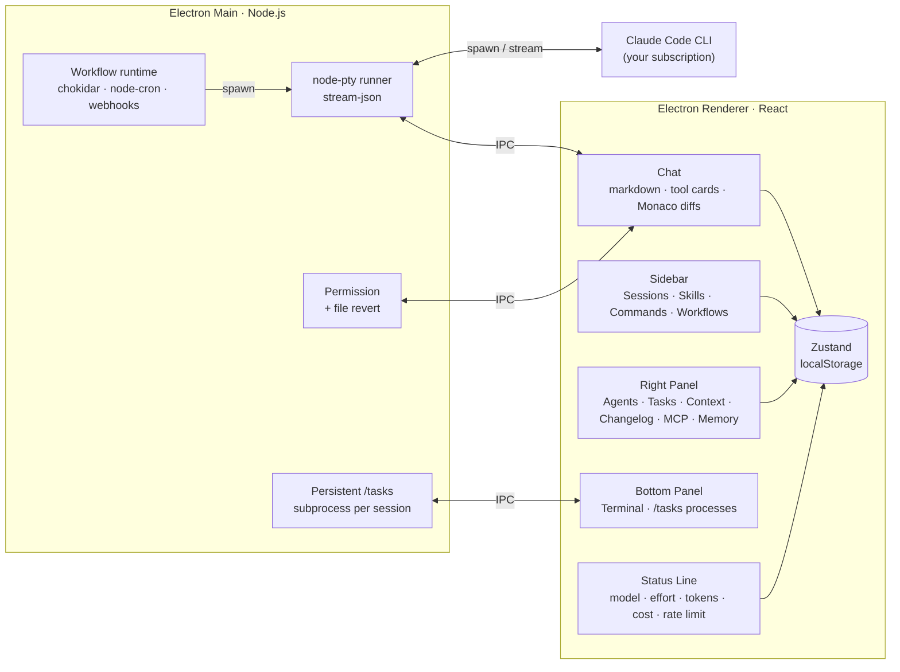
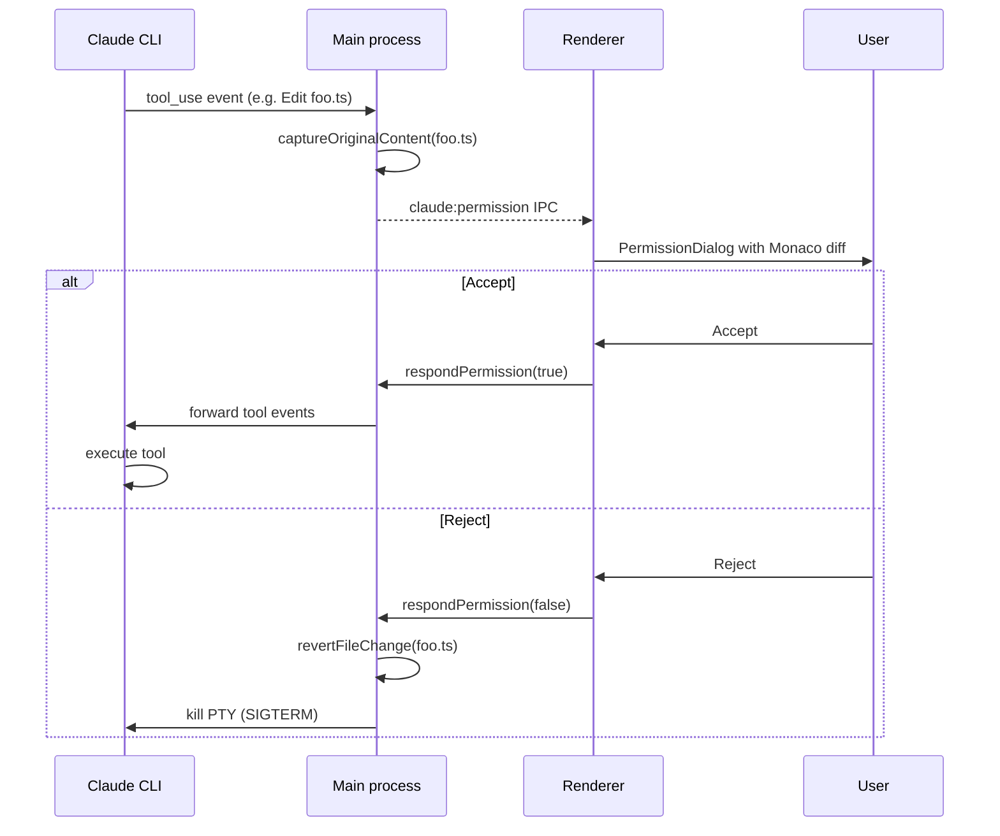

# Coide

[](https://github.com/vicmaster/coide/actions/workflows/ci.yml)
[](https://opensource.org/licenses/MIT)
[](https://nodejs.org)

A desktop GUI client for [Claude Code](https://docs.anthropic.com/en/docs/claude-code) that wraps the CLI you already use — same account, same subscription, no API key needed.

Built with Electron, React, and TypeScript. Talks to Claude through `node-pty`, giving it a real TTY so everything works exactly like the terminal, but with a proper UI on top.

<p align="center"></p>

## Features

**Chat & Sessions**
- Streamed responses with markdown + shiki syntax highlighting
- Multi-turn sessions — create / switch / delete / rename / fork; auto-titled; full-text search across history
- Per-session working directory picker
- Edit and re-run past messages
- Message queuing — type and send while Claude is still responding
- Slack-style date separators between messages from different days
- Copy conversation as markdown / ChatGPT format, or pick individual code blocks (`/copy`)
- History search (Ctrl+R) and message stash (Ctrl+S)

**Model & Reasoning**
- Switch model mid-session — Opus / Sonnet / Haiku
- Effort selector — low / med / high / max
- Plan mode toggle (auto-accept edits during strategic planning)
- Extended thinking indicator
- `/compact` and auto-compaction when nearing the context limit; `/context` tips

**Tools, Permissions & Diffs**
- Collapsible tool call cards with real-time output
- Permission dialog with full context before any tool runs
- Per-tool auto-approve via `/permissions` (replaces global skip-permissions toggle)
- Monaco diff viewer for Edit / Write with Accept / Reject
- Automatic file revert on rejection

**Right Panel**
- **Agents** — live sub-agent hierarchy with status, duration, tokens; cancel/re-run individuals; timeline view showing parallelism
- **Tasks** — live todo updates from Claude with status dots and progress bar
- **Context** — token bar with input / output / cache breakdown; files in context
- **Changelog** — every file touched with cumulative diff and one-click revert
- **MCP** — global + project servers with scope badges
- **Memory** — inline Monaco editor for auto-memories and CLAUDE.md (global / project / subagent)

**Visual Workflows**
- React Flow canvas (`Cmd+W`) for chained Claude runs
- Prompt, Condition, Script, Sub-workflow nodes; parallel branches and loops
- Per-node variables, tool filters, and model selection
- Triggers: manual, file watcher, cron, webhook
- Template marketplace via the public [coide-flows-marketplace](https://github.com/vicmaster/coide-flows-marketplace) repo
- Per-workflow metrics — success rate, duration, cost

**Status Line**
- Current model, effort, token usage, estimated cost
- Rate limit % with live reset countdown
- Session ID

**Integrated Terminal & Tasks**
- xterm.js terminal with multi-tab support, resizable, `Cmd+J` toggle
- `/tasks` background process manager — long-running bashes survive across turns
- Status-bar chip with Kill action and live output tail

**Customization**
- Skill editor — create / edit / import / export skills without touching files
- Visual hook configuration UI
- Settings modal — theme (Light / Dark / System), permissions, model defaults
- In-app `/login` — embedded terminal runs `claude /login`; on 401 mid-turn the failed prompt is auto-retried after re-auth
- Onboarding wizard for first-time users

**Sidebar & Commands**
- Sessions with project labels and search
- Skills browser
- Commands panel with `/` slash autocomplete
- Workflows tab

**Other**
- Image / screenshot drag-and-drop with automatic compression
- File attachments — PDF, DOCX, XLSX, PPTX, CSV, plain text (with text extraction)
- @-mentions — files, folders, URLs, running sub-agents
- `/loop` recurring tasks (cron-like intervals)
- `/stats` token/cost view, `/release-notes` changelog modal
- Desktop notifications, in-session search with highlighting, jump-to-bottom pill
- Keyboard shortcuts — `Cmd+K` clear, `Cmd+N` new session, `Cmd+[`/`Cmd+]` switch, `Esc` stop
- macOS-native title bar

## Prerequisites

- [Claude Code CLI](https://docs.anthropic.com/en/docs/claude-code) installed and authenticated
- Node.js 20+
- macOS (primary target — may work on Linux/Windows with adjustments)

## Setup

```bash
git clone https://github.com/vicmaster/coide.git
cd coide
npm install
npx electron-rebuild -f -w node-pty
```

## Development

```bash
npm run dev
```

## Build

```bash
npm run build      # compile TypeScript + bundle
npm run package    # build + create distributable (.dmg, .zip)
```

## Testing

```bash
npm test           # run Vitest suite once
npm run test:watch # watch mode
```

## Architecture



### Permission Flow

When Claude wants to use a tool, the main process intercepts the call before it runs. For file edits, it captures the original contents first so a rejection can fully revert the change.



## Tech Stack

| Layer | Tech |
|-------|------|
| Shell | Electron 35, electron-vite, node-pty |
| UI | React 19, TypeScript, Tailwind CSS v3 |
| Editor | Monaco Editor (diffs) |
| Terminal | xterm.js |
| Workflows | React Flow (`@xyflow/react`), chokidar, node-cron |
| Markdown | react-markdown, shiki |
| State | Zustand with persist middleware |
| Tests | Vitest, Testing Library, jsdom |

## Windows Support

Looking for Windows? Check out [coide-main](https://github.com/yexi-fun/coide-main) by [@yexi-fun](https://github.com/yexi-fun) — a Windows-adapted fork of coide with full Windows compatibility.

---

See [CONTRIBUTING](CONTRIBUTING.md) · [SECURITY](SECURITY.md) · [LICENSE](LICENSE) (MIT)
